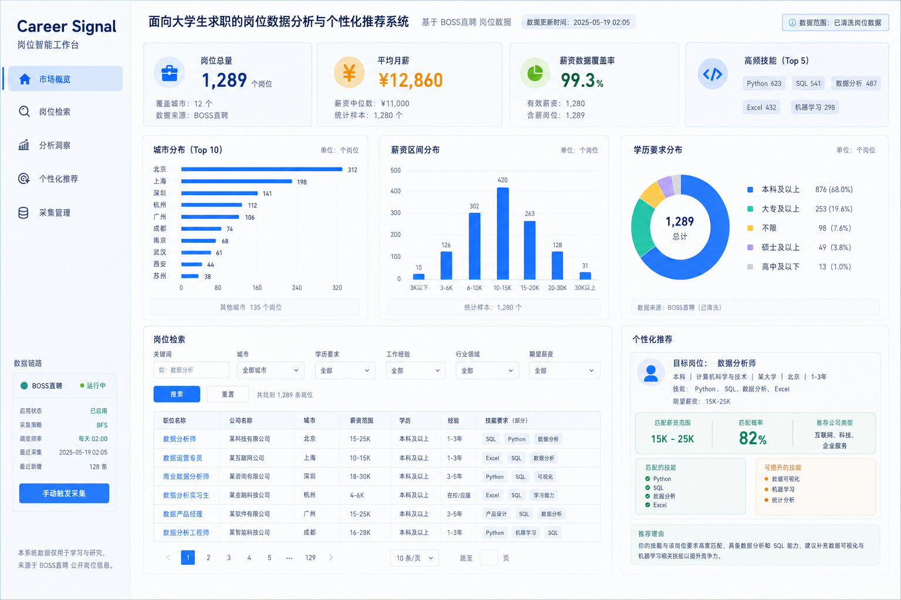

# 前端设计说明

## 1. 文档状态

- 版本：`v1.0`
- 确认日期：`2026-09-03`
- 适用范围：Streamlit 主页面、岗位分析、个性化推荐和采集管理
- 设计基线：C 的浅色配色 + B 的数据工作台布局与组件结构



> 图片用于固定视觉方向。图中的数字、公司名称、趋势线和推荐结果均为设计示意，运行页面必须使用服务层和算法层的真实返回，不能照抄图片中的结果。

### 1.1 各入口设计稿

首页设计稿覆盖“市场概览”；其余四个导航入口使用同一套视觉基线，分别补充如下：

| 入口 | 设计稿 |
|---|---|
| 市场概览 | [前端设计稿-v1.png](assets/前端设计稿-v1.png) |
| 岗位检索 | [前端设计稿-岗位检索-v1.png](assets/前端设计稿-岗位检索-v1.png) |
| 分析洞察 | [前端设计稿-分析洞察-v1.png](assets/前端设计稿-分析洞察-v1.png) |
| 个性化推荐 | [前端设计稿-个性化推荐-v1.png](assets/前端设计稿-个性化推荐-v1.png) |
| 采集管理 | [前端设计稿-采集管理-v1.png](assets/前端设计稿-采集管理-v1.png) |

补充稿用于固定页面级布局和组件层级；示意数据仍不作为运行页面的硬编码来源。

## 2. 设计目标

页面面向需要实习和校招信息的大学生，也支持管理员查看采集状态。用户进入页面后按以下顺序完成操作：

```text
确认数据状态 → 查看市场概览 → 筛选岗位 → 查看分析洞察 → 生成个性化推荐
```

页面要让用户快速回答三个问题：

1. 当前有哪些岗位，城市、薪资和学历要求如何分布？
2. 岗位需要哪些能力，企业和薪资因素有什么样的统计关联？
3. 根据我的画像，哪些岗位更适合，匹配依据是什么？

## 3. 页面信息架构

侧边栏只展示当前项目可以实际运行的五个模块，不为未建模功能预留空菜单：

| 模块 | 页面内容 | 数据来源 |
|---|---|---|
| 市场概览 | 岗位总量、平均月薪、薪资数据覆盖率、高频技能、城市/薪资/学历分布 | `summarize_jobs`、`salary_distribution`、`education_distribution` 与清洗岗位表 |
| 岗位检索 | 关键词、城市、学历、经验、行业、薪资筛选；分页结果、岗位详情和 CSV 下载 | `filter_jobs`、`paginate_jobs` |
| 分析洞察 | 薪资因素、技能频率/共现、企业画像、KMeans 岗位聚类 | 郑维豪算法接口 |
| 个性化推荐 | 学生画像输入、待遇区间、企业画像、匹配概率、匹配/缺失技能、推荐理由 | `StudentProfile` 与多因素推荐 |
| 采集管理 | BOSS 站点配置、启停、BFS/DFS、开始时间、频率、手动触发、任务状态 | 网站与采集任务服务 |

### 3.1 市场概览

采用 B 的信息密度，但只放项目已有或可以由固定接口可靠计算的指标：

- `岗位总量`：`job_count`；
- `平均月薪`：`salary_avg`；
- `薪资数据覆盖率`：有效 `salary_avg` 数量 / 岗位总量；
- `高频技能`：`top_skills` 的前 5 项；
- 城市岗位分布：按 `city` 统计岗位数量，最多展示 10 个城市；
- 薪资区间使用 `salary_distribution`，学历分布使用 `education_distribution`；没有对应返回结构的统计不得展示。

不显示“投递竞争比”“新发岗位量”“近 30 天趋势”，因为当前字段没有投递数据、岗位发布时间或历史快照。

### 3.2 岗位检索

- 搜索范围：岗位名称、公司、技能和岗位描述；
- 固定筛选：关键词、城市、工作方式、经验、学历、行业、公司性质、薪资上下限；
- 结果表至少显示：岗位、公司、城市、类型、经验、学历、待遇、技能、来源；
- 无结果时显示可理解的提示，不显示空表冒充成功；
- 详情区显示岗位描述、福利、来源和清洗后的字段；
- 结果分页使用 `paginate_jobs` 返回的 `total`、`page`、`page_size` 和 `total_pages`；筛选条件改变后回到第 1 页；
- 可下载当前筛选结果 CSV，不能把 CSV 下载称为“报告导出”。

### 3.3 分析洞察

分析页使用有标题、图例、单位和数据范围说明的图表：

- 薪资因素：展示因素分组和重要性，文案只描述统计关联；
- 能力需求：展示技能频率，必要时补充技能共现边表；
- 企业画像：展示公司规模、性质、行业、薪资摘要和技能摘要；
- 岗位聚类：展示群组数量、岗位数量、平均薪资、代表城市和高频技能；
- 随机森林薪资预测的 MAE/R² 如需要面向答辩展示，放在分析页的轻量“模型评估”区域，不改变现有主布局。

禁止将“工作经验可显著提升薪资”作为因果结论，统一改为“当前样本中不同工作经验组的平均薪资存在差异”等表述。

### 3.4 个性化推荐

画像输入严格使用 `StudentProfile` 字段：

- 目标岗位；
- 学历、专业、学校；
- 期望城市；
- 工作年限、工作/项目经历；
- 已掌握技能；
- 期望月薪上下限。

推荐卡显示固定返回字段：岗位、公司、公司规模、公司性质、行业、薪资区间、匹配概率、匹配技能、缺失技能和推荐理由。没有接口来源的“需求量”“热度趋势”和“平均薪资”不写进卡片。

### 3.5 采集管理

首期只把 BOSS 直聘作为实际数据源。页面支持：

- 网站新增、查看、修改、删除和启停；
- 关键词、城市、BFS/DFS、最大深度、开始时间和采集频率配置；
- 手动触发任务；
- 展示任务状态、开始时间、原始记录数、解析成功数、异常数和错误信息；
- 明确显示“按需触发/定时批量采集”，不暗示实时更新。

其他招聘平台可以复用配置边界，但在真实适配器和数据来源确认前不显示为正常数据源。

## 4. 视觉规范

### 4.1 色彩 Token

| Token | 色值 | 用途 |
|---|---|---|
| `--page-bg` | `#F5F8FD` | 页面背景 |
| `--surface` | `#FFFFFF` | 卡片、表格、表单面板 |
| `--text` | `#102B63` | 标题和主要文字 |
| `--muted` | `#60708F` | 辅助文字、单位、说明 |
| `--primary` | `#2878F0` | 主按钮、激活导航、主要图表 |
| `--success` | `#2FB77A` | 正常状态、匹配成功、覆盖率 |
| `--salary` | `#F1A52B` | 薪资数字和薪资图表 |
| `--warning` | `#D96C52` | 采集异常和风险提示 |
| `--border` | `#DCE6F4` | 卡片、输入框和表格边界 |

颜色只按语义使用：绿色表示正常或匹配，橙色表示薪资重点，红色/珊瑚色表示错误，不能用状态颜色装饰无意义元素。

### 4.2 布局和组件

- 页面采用宽屏数据工作台布局，左侧固定导航，右侧为主内容；
- 顶部展示产品名称、当前数据入口和数据更新时间；
- 首屏使用 4 个 KPI 卡片，不使用概念图中的超大市场数字；
- 图表采用三列分析区，移动端按顺序堆叠；
- 下方采用“岗位结果表 + 个性化推荐面板”双栏结构；
- 卡片使用小圆角、浅边框和轻阴影，不使用大面积玻璃拟态和霓虹发光；
- 页面主按钮每个区域最多一个，其他操作降级为普通按钮或链接；
- 所有输入控件有可读标签、键盘焦点和空值提示。

### 4.3 图表规范

- 使用项目已有 Plotly，不新增图表框架；
- 图表必须有标题，坐标轴有单位，颜色有图例或说明；
- 颜色顺序优先使用蓝色、绿色、黄色，避免彩虹色；
- 鼠标悬停只补充数据，不把关键结论藏在悬停状态；
- 数据为空或样本不足时显示原因和下一步，不渲染伪图表。

## 5. 交互和状态规范

每个数据区域至少处理以下状态：

| 状态 | 页面表现 |
|---|---|
| 正常 | 显示数据、图表和来源说明 |
| 文件缺失 | 显示清洗文件路径和接入提示 |
| 空数据 | 显示空状态，不渲染误导性指标 |
| 筛选无结果 | 提示放宽筛选条件 |
| 模型未加载/样本不足 | 显示算法返回的明确错误原因 |
| 采集失败 | 显示任务失败状态和错误信息，不标记为成功 |
| 运行中 | 显示任务状态；首期不伪造实时进度 |

筛选和画像输入使用表单提交，避免每个字段变化都触发完整计算；推荐结果保存在当前会话，页面重新运行时不丢失已经生成的结果。页面不保存个人敏感信息，不保存账号 Cookie。

## 6. 实现边界

### 6.1 直接使用现有能力

- `app.py` 负责读取清洗岗位表并把数据错误传给页面；
- `src/ui/pages.py` 负责布局、控件、图表和状态展示；
- `src/services/job_service.py` 负责岗位筛选和基础汇总；
- `src/services/site_service.py`、`src/services/task_service.py` 负责采集管理；
- `src/algorithms/` 中已有算法负责分析和推荐，页面不复制模型逻辑；
- 运行依赖保持 `streamlit`、`pandas`、`plotly` 和已有算法依赖，不新增 React、动画库或 UI Kit。

### 6.2 暂不实现

- 投递竞争比、新发岗位量、近 30 天趋势；
- 收藏夹、投递记录、用户登录、通知中心和头像账号体系；
- 多平台真实数据源状态；
- 职业测评、求职工具、行业报告和 PDF 报告导出；
- 为了匹配设计稿而硬编码岗位数字、公司名称、图表趋势或推荐结果。

如果后续确需实现趋势，先在接口中增加岗位发布时间或历史采集快照；如果需要账号和投递记录，先单独确认数据模型与隐私边界。

## 7. 素材和动效

- 当前设计不依赖 PNG 素材；图标优先使用内联 SVG 或 CSS，图表使用 Plotly；
- 本目录中的 `assets/前端设计稿-v1.png` 仅作为设计参考，不由运行页面加载；
- 不新增动画库；使用 CSS 的轻量 hover、淡入和状态过渡即可；
- 所有动效必须在 `prefers-reduced-motion: reduce` 下自动降级；
- 只有加入拖拽、复杂转场或实时局部动画时，才评估 Streamlit Custom Component 或 React，不能为了装饰提前扩展技术栈。

## 8. 验收清单

- [x] 一条 `streamlit run app.py` 命令可以启动；
- [x] 首屏显示实际数据源和数据状态；
- [x] 五个模块均有可操作入口，没有空菜单；
- [x] 正常岗位数据可以展示 KPI、图表、岗位结果和推荐结果；
- [x] 修改筛选条件会改变结果数量或统计内容；
- [x] 修改学生画像会改变推荐排序、匹配概率或推荐理由；
- [x] 薪资因素、能力需求和企业画像均有标题、图例或说明；
- [x] 文件缺失、空数据、无结果、模型未加载和采集失败均有提示；
- [x] 页面不直接读取 `data/raw/`，不硬编码最终结果；
- [x] 负责人实际查看 `git diff`，并完成一个正常案例和一个异常/空数据案例；
- [x] 截图、演示路径和本设计说明保持一致。

实现分支：`feat/lushihao-frontend-redesign`。视觉与交互验收记录见项目根目录 `design-qa.md`。
